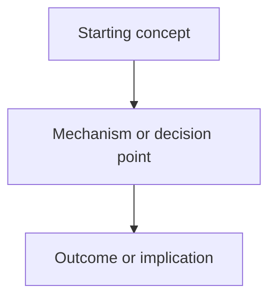
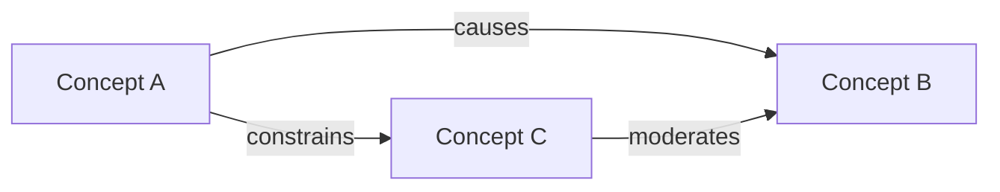

# Knowledge Graph Template

Use this structure inside each generated subject/deck wiki note and inside each lecture-level `_course-knowledge-graph.md`.

Lecture-level `_course-knowledge-graph.md` files should be graph-view-first. Put Mermaid visual graphs before row-based node/edge data. The tables are supporting references, not the primary learning view.

## Mermaid Flow

Use this for causal chains, process flows, decision rules, calculation logic, legal tests, or framework sequencing.

## Mermaid Concept Graph

Use this for relationships among concepts. Prefer labeled edges when the relationship matters for recall.

## Supporting Node And Edge List

| Node | Meaning | Exam Relevance |
|---|---|---|
|  |  |  |

| From | Relationship | To | Why It Matters |
|---|---|---|---|
|  |  |  |  |

## Visual Recall Prompts

1. Recreate the graph from memory.
2. Explain the strongest causal edge.
3. Identify the edge most likely to be tested in an exam case.
4. Name one missing condition or exception that would change the graph.
