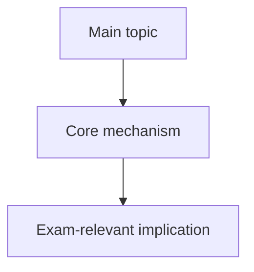

# Topic Title

Source: `raw/source-file-name.pptx`
Course:
Processed:
Wiki note:

## 80/20 Exam Summary

List the few concepts that unlock most questions from this deck.

## Core Concepts

Explain the key terms, frameworks, rules, formulas, or mechanisms. Prioritize understanding over slide-by-slide transcription.

## Mechanisms And Logic

For each major concept:

- What problem does it solve?
- What are the steps or causal chain?
- What assumptions does it rely on?
- What changes the answer?

## Diagrams, Tables, And Visuals

Explain any diagram, model, chart, table, or process flow in words. Include what the visual is trying to make the student infer.

## Visual Knowledge Map

Create a subject-specific Mermaid diagram for this source. Use top-to-bottom flowcharts for causal/process logic and left-to-right graphs for concept relationships.

## Subject Knowledge Graph

List the most important nodes and edges from this source. These should later be merged into the lecture-level `_course-knowledge-graph.md`.

| Node | Meaning | Exam Relevance |
|---|---|---|
|  |  |  |

| From | Relationship | To | Why It Matters |
|---|---|---|---|
|  |  |  |  |

## Real Business Examples

Connect the material to real organizations, markets, contracts, operations, investments, or managerial decisions.

## Exam Relevance

Likely exam prompts:

- 

Common traps:

- 

How to structure a high-scoring answer:

- 

## Retrieval Prompts

Closed-book questions:

1. 
2. 
3. 

Application prompts:

1. 
2. 
3. 

## Practice Tasks

Include short answer, issue-spotting, calculation, comparison, or mini-case tasks depending on the course.

## Connections

Previous notes from this lecture:

- 

Cross-course links:

- 

## Weakness Flags

Use this section after coaching sessions to track what needs another retrieval pass.

- 
